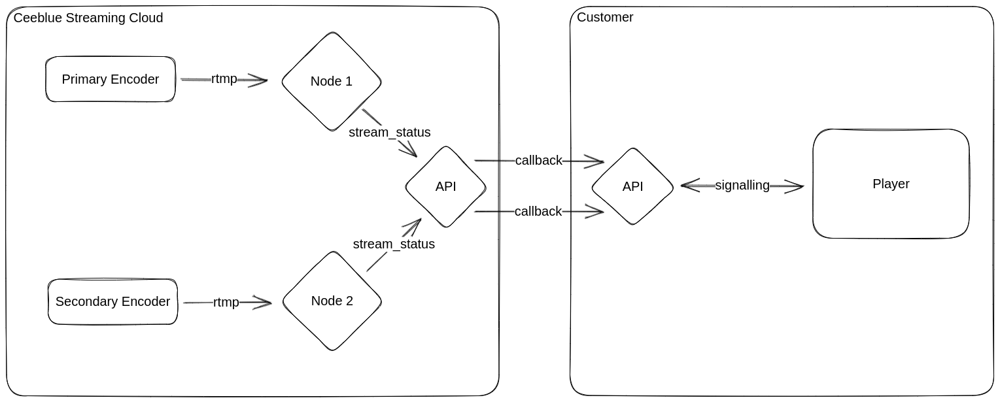

# Template for a failover service

This is is a template script implementing an example of a failover service that :

* Retrieves the current best endpoint for viewers to connect to,
* Implement a redundant/failover mechanism to switch to another stream in case of failure.

All this is done using the [Ceeblue API] which is responsible of the load balancing.

The drawing below shows the architecture of the redundancy mechanism implemented by this script:

[](ceeblue-stream-redundancy.png)

> The API object on the right side is this script.

## How to use

**You need Node.js installed on your machine to run this script.**

The first step is to install the required dependencies:

```bash
npm install
```

Setup the CEEBLUE_TOKEN with your JWT first (see [here](https://docs.ceeblue.net/reference/authorization)).
Then, run the script with the following command:

```bash
node failover-service.js
```

You can optionally specify the port to listen to with the `HTTP_PORT` environment variable:

```bash
HTTP_PORT=8080 node failover-service.js
```

## Going further

This script is a simple example of a failover service. You can extend it to implement more complex API and failover mechanisms.

Open the `failover-service.js` file and start editing it to fit your needs. Everything is commented to help you understand how it works and how to call your custom API.

[Ceeblue API]: https://docs.ceeblue.net/reference/
